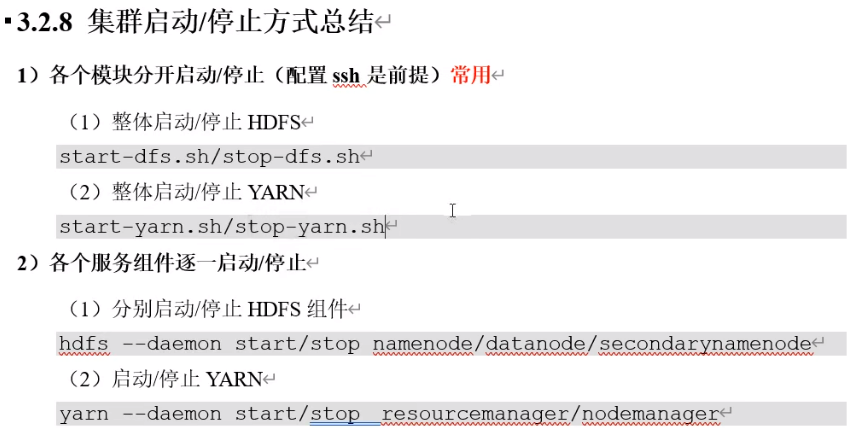
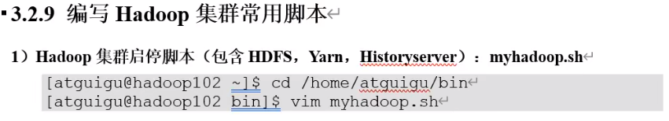
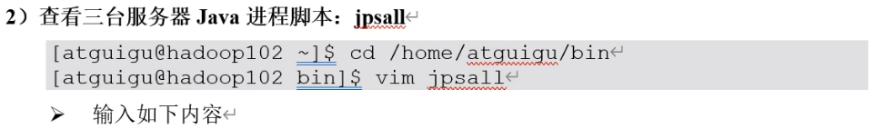

```shell
#!/bin/bash

if [ $# -lt 1 ]
then
	echo "No Args Input..."
	exit;
fi
	
case $1 in
"start")
	echo "============= 启动 Hadoop 集群 ============="
	
	echo "------------- 启动 HDFS -------------"
	ssh hadoop102 "/opt/module/hadoop-3.1.3/sbin/start-dfs.sh"
	echo "------------- 启动 yarn -------------"
	ssh hadoop103 "/opt/module/hadoop-3.1.3/sbin/start-yarn.sh"
	echo "------------- 启动 historyserver -------------"
	ssh hadoop102 "/opt/module/hadoop-3.1.3/bin/mapred --daemon start historyserver"
;;

"stop")
	echo "============= 关闭 Hadoop 集群 ============="
	
	echo "------------- 关闭 historyserver -------------"
	ssh hadoop102 "/opt/module/hadoop-3.1.3/bin/mapred --daemon stop historyserver"
	echo "------------- 关闭 yarn -------------"
	ssh hadoop103 "/opt/module/hadoop-3.1.3/sbin/stop-yarn.sh"
	echo "------------- 关闭 HDFS -------------"
	ssh hadoop102 "/opt/module/hadoop-3.1.3/sbin/stop-dfs.sh"
;;

*)
	echo "Input Args Error..."
;;
esac
```



```shell
#!/bin/bash
for host in hadoop102 hadoop103 hadoop104
do
	echo ============ $host ============
	ssh $host jps
done
```

