# 集群规划

1. 本次安装拟使用的各软件版本如下

- CentOS 7.6
- Zookeeper 3.6.3
- Hadoop 3.2.2
- Hive 3.1.2
- Spark 3.0.2
- Sqoop 1.4.7
- MySQL 8.0.21

1. 机器规划

| 机器名称  | zookeeper | journalnode | namenode | datanode | yarn | mysql | hive | spark |
| :-------- | :-------- | :---------- | :------- | :------- | :--- | :---- | :--- | :---- |
| hadoop101 | Y         | Y           | Y        | Y        | Y    | Y     | Y    | Y     |
| hadoop102 | Y         | Y           | Y        | Y        |      |       | Y    | Y     |
| hadoop103 | Y         | Y           |          | Y        | Y    |       |      | Y     |

## 一、安装CentOS 7.6

若使用虚拟机，建议选择2CPU2线程，4G或以上内存，至少50G硬盘。

安装过程注意事项主要包括：

1. 日期和时间：选择上海
2. 语言支持：简体中文和英语
3. 软件选择：最小安装，选择其中的调试工具、兼容性程序库、开发工具、安全性工具、和系统管理工具
4. 设置root密码：root123

安装完成后，重启即可登录系统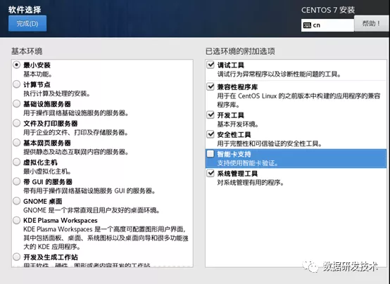

## 二、配置Linux

使用root用户登录机器，进行相关配置

### 2.1 配置IP地址

修改文件/etc/sysconfig/network-scripts/ifcfg-ens33，变更相关配置，应保证hadoop集群机器IP地址不变

```
ONBOOT=yes
BOOTPROTO=static
IPADDR=192.168.100.124
NETMASK=255.255.255.0
GATEWAY=192.168.100.1
DNS1=114.114.114.114
DNS2=218.2.135.1
```

### 2.2 基础配置

1. 配置主机名。根据机器不同，设置不同的主机名，从hadoop101开始。命令：`hostnamectl set-hostname hadoop101`
2. 关闭防火墙。依次执行下列命令，最后查看防火墙状态

```
systemctl stop firewalld.service            #停止firewall
systemctl disable firewalld.service         #禁止firewall开机启动
systemctl status firewalld.service   #查看firewall状态
```

1. 关闭selinux。修改文件/etc/sysconfig/selinux，将SELINUX=enforcing改为SELINUX=disabled。然后重启后用`sestatus`命令查看状态

```
# sestatus
SELinux status:                 disabled
```

1. 安装net-tools。可在线或离线安装

```
# 在线安装命令
sudo yum -y install net-tools

# 离线安装
# 下载net-tools包，centos7版本： 
http://mirrors.163.com/centos/7/os/x86_64/Packages/net-tools-2.0-0.25.20131004git.el7.x86_64.rpm
# 离线安装命令
sudo rpm -Uvh net-tools-2.0-0.25.20131004git.el7.x86_64.rpm

# 验证安装是否成功
netstat -nltp
```

### 2.3 配置hadoop用户

本次安装计划在hadoop用户下，安装和使用hadoop集群 。命令如下：

```
# 首先创建用户
useradd hadoop
# 配置密码
passwd hadoop  # 将hadoop的密码设置为：hadoop123
# 配置sudo权限
vi /etc/sudoers
# 在101行左右，添加一行：
hadoop  ALL=(ALL)       NOPASSWD:ALL
```

### 2.4 配置基本目录

为hadoop集群安排3个目录存放相关内容

- 程序目录：/app
- 数据目录：/data
- 日志目录：/applogs

```
mkdir /app /applogs /data
chown -R hadoop: /app /data /applogs
```

**从本步骤之后，不做特别说明，均使用hadoop用户进行相关操作**

### 2.5 安装jdk

1. 下载：https://www.oracle.com/java/technologies/javase/javase-jdk8-downloads.html
2. 上传到Centos后解压并安装

```
# 解压上传的文件
tar zxvf jdk-8u281-linux-x64.tar.gz -C /app/
# 配置环境变量
sudo vi /etc/profile.d/env.sh
sudo chmod 777 /etc/profile.d/env.sh
# 在文件中添加下列配置
export JAVA_HOME=/app/jdk1.8.0_281
export CLASSPATH=.:$JAVA_HOME/lib/dt.jar:$JAVA_HOME/lib/tools.jar
export PATH=$JAVA_HOME/bin:$PATH
# 完成后，启用环境变量
source /etc/profile
```

1. 验证是否安装完成

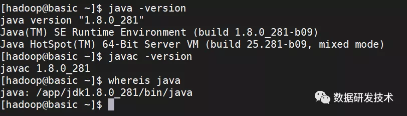

### 2.6 配置管理脚本

创建脚本存放目录：mkdir -p /home/hadoop/bin

#### 2.6.1 配置分发脚本

创建脚本/home/hadoop/xsync，文件写入下列内容，并赋予执行权限`chmod +x xsync`

```
#!/bin/bash

#1. 判断参数个数
[ $# -lt 1 ] && {
    echo Not Enough Arguement!
    exit
}

# 遍历所有目标，同步所有文件
for file in $@
    do 
    echo ====================== sync $file =====================
 [ -e $file ] && {
        for host in hadoop101 hadoop102 hadoop103 
            do
  echo ----------------- $host --------------------
         #5. 获取父目录
                pdir=$(cd -P $(dirname $file); pwd)
        
         #6. 获取当前文件的名称
                fname=$(basename $file)
                ssh $host "mkdir -p $pdir"
                rsync -av $pdir/$fname $host:$pdir
            done
 } || {
     echo $file does not exists, please check again!
 }
done
```

#### 2.6.2 配置进程查看脚本

创建文件 /home/hadoop/bin/jpsall，输入下列内容，并授予执行权限

```
#!/bin/bash

for host in hadoop101 hadoop102 hadoop103
do
    echo =============== $host ===============
    ssh $host jps
done
```

### 2.7 克隆虚拟机

将本基础机器关闭，再克隆生成三台新的虚拟机，注意克隆时选择创建完整克隆

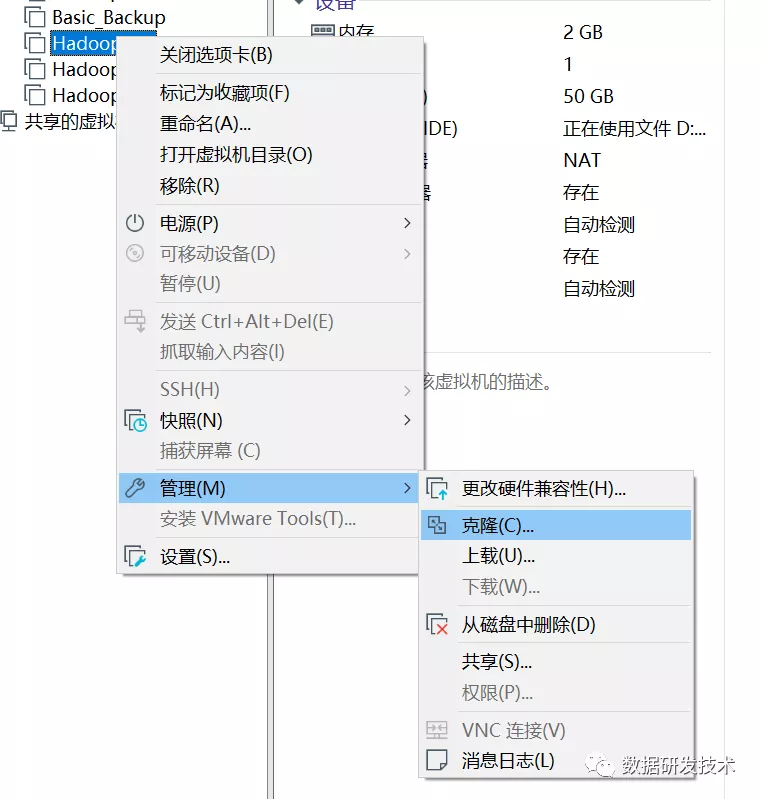

### 2.8 依次配置3台机器

- 配置ip地址

- 配置主机名，主机名配置为hadoop101、hadoop102、hadoop103

  ```
  hostnamectl set-hostname hadoop101
  ```

- 修改所有机器的 /etc/hosts，添加以下内容：

  ```
  192.168.100.124 hadoop101
  192.168.100.129 hadoop102
  192.168.100.130 hadoop103
  ```

- 为3台机器做ssh免密访问。要求效果root之间免密访问，hadoop用户之间免密访问。

  ```
  ssh-keygen -t rsa
  # 将所有服务器的 id_rsa.pub 内容汇总到 authorized_keys
  # ！！！ 伪分布式，也必须要先生成 authorized_keys 文件！！！
  
  # 复制到其他服务器
  # scp authorized_keys @hadoop002:$PWD
  # ssh-copy-id 将key写到远程机器的 ~/ .ssh/authorized_key.文件中
  ssh-copy-id -i ~/.ssh/id_rsa.pub hadoop@hadoop101
  # 修改hadoop用户的.ssh下的权限（root不用修改）
  sudo chmod 700 /home/hadoop/.ssh
  sudo chmod 600 /home/hadoop/.ssh/*
  ```

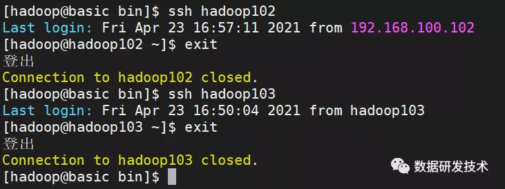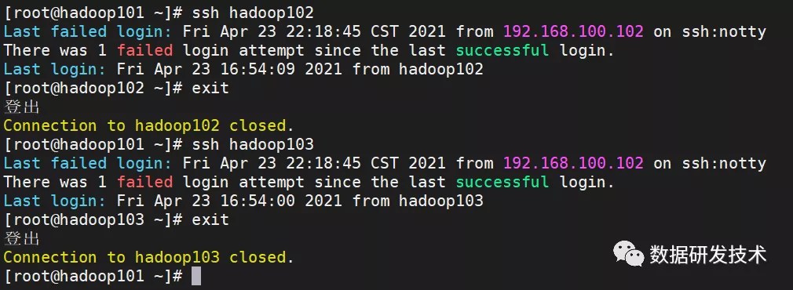

### 2.9 配置时间同步

**首先从服务器先同步时间，再执行以下操作**

```
sudo ntpdate ntp1.aliyun.com`或者使用命令`sudo ntpdate 192.168.100.124
```

1. 编辑 hadoop101 时间服务器配置文件 `sudo vi /etc/ntp.conf`

   ```
   #这一行的含义是授权172.16.128.0网段上的所有机器可以从这台机器上查询和同步时间.
   restrict 192.168.100.0 mask 255.255.255.0 nomodify notrap
   # 修改server段内容
   server 210.72.145.44
   server ntp1.aliyun.com
   server ntp2.aliyun.com
   server ntp3.aliyun.com
   server 0.centos.pool.ntp.org iburst
   server 1.centos.pool.ntp.org iburst
   server 2.centos.pool.ntp.org iburst
   server 3.centos.pool.ntp.org iburst
   server 127.127.1.0
   fudge 127.127.1.0 stratum 10
   ```

2. 编辑其他机器的时间服务配置文件`sudo vi /etc/ntp.conf`

   ```
   server 192.168.100.124
   fudge 192.168.100.124 stratum 10
   ```

3. 启动ntpd服务并设置开机启动

   ```
   sudo service ntpd start
   sudo systemctl enable ntpd
   sudo systemctl enable ntpdate
   sudo systemctl is-enabled ntpd
   ```


## 三、安装Zookeeper

### 1. 安装步骤

1. 下载zookeeper3.6.3版本，解压文件到/app路径下

   下载地址：**https://mirrors.tuna.tsinghua.edu.cn/apache/zookeeper/zookeeper-3.6.3/apache-zookeeper-3.6.3-bin.tar.gz**

   ```
   tar zxvf apache-zookeeper-3.6.3-bin.tar.gz -C /app/
   ```

2. 建立相关的目录，存放数据和日志

   ```
   mkdir -p /data/zookeeper/zdata/data
   mkdir -p /data/zookeeper/zdata/logs
   ```

3. 为各服务器在data目录下，生成myid文件，不同服务器myid内值不能相同。从1开始，依次增加

   ```
   echo 1 > /data/zookeeper/zdata/data/myid
   ```

4. 修改zookeeper的配置文件，复制zoo_sample.cfg为zoo.cfg

   ```
   cd /app
   ln -s apache-zookeeper-3.6.3-bin zookeeper
   cd zookeeper/conf
   cp zoo_sample.cfg zoo.cfg
   # 修改zoo.cfg,以下为配置信息
   dataDir=/data/zookeeper/zdata/data
   dataLogsDir=/data/zookeeper/zdata/logs
   # 副本数
   autopurge.snapRetainCount=3
   server.1=hadoop101:2888:3888
   server.2=hadoop102:2888:3888
   server.3=hadoop103:2888:3888
   4lw.commands.whitelist=*
   ```

5. 分发zookeeper到各服务器，注意修改各服务器的myid

   ```
   cd /app
   xsync apache-zookeeper-3.6.3-bin zookeeper
   cd /data
   xsync zookeeper
   
   # 在hadoop102执行
   echo 2 > /data/zookeeper/zdata/data/myid
   # 在hadoop103执行
   echo 3 > /data/zookeeper/zdata/data/myid
   ```

6. 配置环境变量

   ```
   # 在/etc/profile.d/env.sh中添加
   export ZOOKEEPER_HOME=/app/apache-zookeeper-3.6.3
   
   # 同步到各机器
   sudo /home/hadoop/bin/xsync /etc/profile.d/env.sh
   # 在所有服务器应用新的环境变量
   ```

7. 编写集群管理脚本 myzookeeper.sh，脚本放置在home目录下面的bin目录中(/home/hadoop/bin)

   ```
   #!/bin/bash
   if [ $# -lt 1 ]
   then
       echo "No Args Input..."
       exit ;
   fi
   case $1 in
   "start")
       echo " =================== 启动 zookeeper 集群 ======================"
       for host in hadoop101 hadoop102 hadoop103
       do
          echo "----------------- 启动 $host -------------------"
          ssh $host "/app/apache-zookeeper-3.6.3/bin/zkServer.sh start"
       done
   ;;
   "stop")
       echo " =================== 关闭 zookeeper 集群 ======================"
       for host in hadoop101 hadoop102 hadoop103
       do
          echo "----------------- 关闭 $host -------------------"
          ssh $host "/app/apache-zookeeper-3.6.3/bin/zkServer.sh stop"
       done
   ;;
   "status")
       echo " =================== 检查 zookeeper 集群 ======================"
       for host in hadoop101 hadoop102 hadoop103
       do
          echo "----------------- 检查 $host -------------------"
          ssh $host "/app/apache-zookeeper-3.6.3/bin/zkServer.sh status"
       done
   esac
   ```

### 2. 启动验证

```
myzookeeper.sh start
```

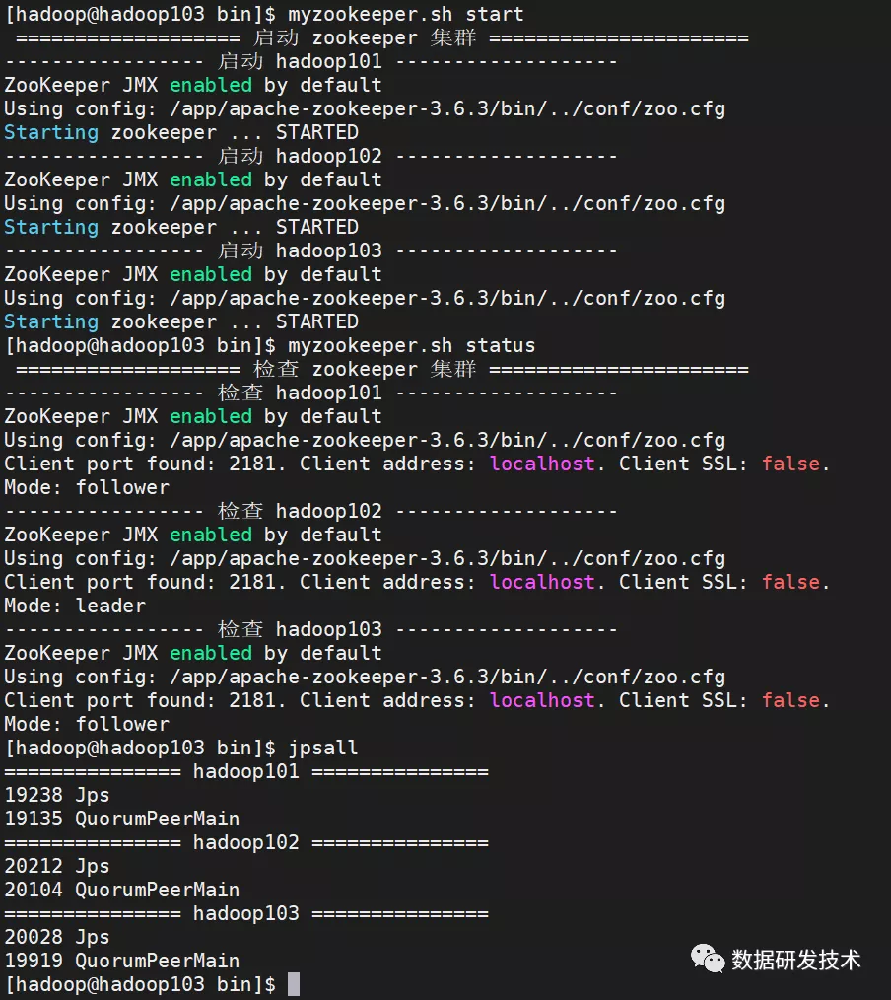

## 四、安装Hadoop

### 1. 安装说明

1. 本次使用Hadoop3.2.2版本
2. 本次安装程序是基于zookeeper搭建HA环境，请先安装zookeeper

### 2. 文件配置

1. 下载解压hadoop：**https://mirrors.bfsu.edu.cn/apache/hadoop/common/hadoop-3.2.2/hadoop-3.2.2.tar.gz**

   ```
   tar zxvf hadoop-3.2.2.tar.gz -C /app
   cd /app
   ln -s hadoop-3.2.2 hadoop
   ```

#### 2.2 配置core-site.xml

```
<!-- HDFS主入口，mycluster仅是作为集群的逻辑名称，可随意更改但务必与hdfs-site.xml中dfs.nameservices值保持一致 -->
<property>
 <name>fs.defaultFS</name>
 <value>hdfs://mycluster</value>
</property>

<!-- 默认的hadoop.tmp.dir指向的是/tmp目录，将导致namenode与datanode数据全都保存在易失目录中，此处进行修改 -->
<property>
 <name>hadoop.tmp.dir</name>
 <value>/data/hadoop/tmp</value>
</property>

<!-- 用户角色配置，不配置此项会导致web页面报错（不能操作数据） -->
<property>
 <name>hadoop.http.staticuser.user</name>
 <value>hadoop</value>
</property>

<!-- zookeeper集群地址，这里只配置了单台，如是集群以逗号进行分隔 -->
<property>
 <name>ha.zookeeper.quorum</name>
 <value>hadoop101:2181,hadoop102:2181,hadoop103:2181</value>
</property>

<!-- 权限配置 hadoop.proxyuser.{填写自己的用户名}.hosts-->
<property>
 <name>hadoop.proxyuser.hadoop.hosts</name>
 <value>*</value>
</property>
<property>
 <name>hadoop.proxyuser.hadoop.groups</name>
 <value>*</value>
</property>

<!-- 解决journalnode连接不上，导致namenode启动问题 -->
<!-- 也有可能是网络的问题，参考该文章:https://blog.csdn.net/tototuzuoquan/article/details/89644127 -->
<!-- 在dev环境中出现连不上journalnode问题，添加该配置，以增加重试次数和间隔 -->
<property>
 <name>ipc.client.connect.max.retries</name>
 <value>100</value>
 <description>Indicates the number of retries a client will make to establish a server connection.</description>
</property>

<property>
 <name>ipc.client.connect.retry.interval</name>
 <value>10000</value>
 <description>Indicates the number of milliseconds a client will wait for before retrying to establish a server connection.</description>
</property>
```

#### 2.3 配置hadoop-env.sh

```
export JAVA_HOME=/app/jdk1.8.0_281
export HDFS_NAMENODE_USER="hadoop"
export HDFS_DATANODE_USER="hadoop"
export HDFS_ZKFC_USER="hadoop"
export HDFS_JOURNALNODE_USER="hadoop"
```

#### 2.4 配置hdfs-site.xml

```
<!-- 副本数配置 -->
<property>
 <name>dfs.replication</name>
 <value>2</value>
</property>

<!-- 集群名称，此值在接下来的配置中将多次出现务必注意同步修改 -->
<property>
 <name>dfs.nameservices</name>
 <value>mycluster</value>
</property>
<!-- 所有的namenode列表，此处也只是逻辑名称，非namenode所在的主机名称 -->
<property>
 <name>dfs.ha.namenodes.mycluster</name>
 <value>nn1,nn2</value>
</property>

<!-- namenode之间用于RPC通信的地址，value填写namenode所在的主机地址 -->
<!-- 默认端口8020，注意mycluster与nn1要和上文的配置一致 -->
<property>
 <name>dfs.namenode.rpc-address.mycluster.nn1</name>
 <value>hadoop101:8020</value>
</property>
<property>
 <name>dfs.namenode.rpc-address.mycluster.nn2</name>
 <value>hadoop102:8020</value>
</property>

<!-- namenode的web访问地址，默认端口9870 -->
<property>
 <name>dfs.namenode.http-address.mycluster.nn1</name>
 <value>hadoop101:9870</value>
</property>
<property>
 <name>dfs.namenode.http-address.mycluster.nn2</name>
 <value>hadoop102:9870</value>
</property>

<!-- journalnode主机地址，最少三台，默认端口8485 -->
<!-- 格式为 qjournal://jn1:port;jn2:port;jn3:port/${nameservices} -->
<!-- a shared edits dir must not be specified if HA is not enabled -->
<!-- 伪分布式时,取消该配置 -->
<property>
 <name>dfs.namenode.shared.edits.dir</name>
 <value>qjournal://hadoop101:8485;hadoop102:8485;hadoop103:8485/mycluster</value>
</property>

<!-- 故障时自动切换的实现类，照抄即可 -->
<property>
 <name>dfs.client.failover.proxy.provider.mycluster</name>
 <value>org.apache.hadoop.hdfs.server.namenode.ha.ConfiguredFailoverProxyProvider</value>
</property>

<!-- 故障时相互操作方式(namenode要切换active和standby)，这里我们选ssh方式 -->
<property>
 <name>dfs.ha.fencing.methods</name>
 <value>sshfence</value>
</property>
<!-- 修改为自己用户的ssh key存放地址 -->
<property>
 <name>dfs.ha.fencing.ssh.private-key-files</name>
 <value>/home/hadoop/.ssh/id_rsa</value>
</property>

<!-- namenode日志文件输出路径，即journalnode读取变更的位置 -->
<property>
 <name>dfs.journalnode.edits.dir</name>
 <value>/data/hadoop/journalnode</value>
</property>

<!-- 启用自动故障转移 -->
<property>
 <name>dfs.ha.automatic-failover.enabled</name>
 <value>true</value>
</property>

<property>
 <name>dfs.webhdfs.enabled</name>
 <value>true</value>
</property>

<!-- 解决 DataXceiver error processing WRITE_BLOCK operation src -->
<property>
 <name>dfs.datanode.max.transfer.threads</name>
 <value>8192</value>
 <description> 
     Specifies the maximum number of threads to use for transferring data
     in and out of the DN. 
 </description>
</property>
```

#### 2.5 配置workers

填入所有datanode的主机名称，不能留有空格

```
hadoop101
hadoop102
hadoop103
```

#### 2.6 配置环境变量

```
export HADOOP_HOME=/app/hadoop-3.2.2
export PATH=$PATH:$HADOOP_HOME/bin
export PATH=$PATH:$HADOOP_HOME/sbin

# 同步到各机器
sudo /home/hadoop/bin/xsync /etc/profile.d/env.sh
# 在所有服务器应用新的环境变量
```

#### 2.7 修改进程最大文件打开数

```
sudo vi /etc/security/limits.conf
# 参考 https://blog.csdn.net/knowledgeaaa/article/details/21240247
# 添加以下内容
*               -      nofile          1000000
*               -      nproc           1000000
```

### 3. 首次启动集群


1. 将同步hadoop目录及配置文件到所有机器

   ```
   cd /app
   xsync hadoop-3.2.2
   ```

2. 启动journalnode，在所有journalnode节点上启动journalnode(本例中是所有机器)

   ```
   hdfs --daemon start journalnode
   ```

3. 初始化namenode，在任意namenode节点上执行格式化命令，出现successfully formated即为执行成功（本次在hadoop101执行）

   ```
   hdfs namenode -format
   # 安装时出现过一次错误：Unable to check if JNs are ready for formatting.
   # 类似 https://blog.csdn.net/Maricle_Again/article/details/96481845
   # 解决办法是删除所有机器 /data/hadoop/journalnode/mycluster 目录下的文件
   # cd /data/hadoop/journalnode/mycluster
   # rm -rf in_use.lock current edits.sync
   ```

   ```
   # 也有可能是网络的问题，参考该文章:https://blog.csdn.net/tototuzuoquan/article/details/89644127
   # 在dev环境中出现连不上journalnode问题，添加该配置，以增加重试次数和间隔
   <property>
       <name>ipc.client.connect.max.retries</name>
       <value>100</value>
       <description>Indicates the number of retries a client will make to establish a server connection.</description>
   </property>
   
   <property>
       <name>ipc.client.connect.retry.interval</name>
       <value>10000</value>
       <description>Indicates the number of milliseconds a client will wait for before retrying to establish a server connection.</description>
   </property>
   ```

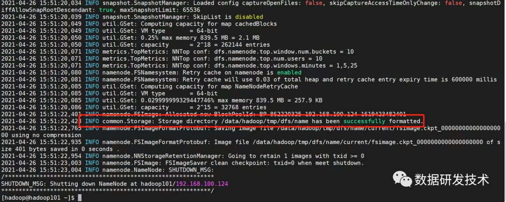

1. 随后启动格式化后的namenode（在hadoop101执行）

   ```
   hdfs --daemon start namenode
   ```

2. 在其他namenode节点同步信息（在hadoop102执行）

   伪分布式部署时，不用执行本步骤

   ```
   hdfs namenode -bootstrapStandby
   ```

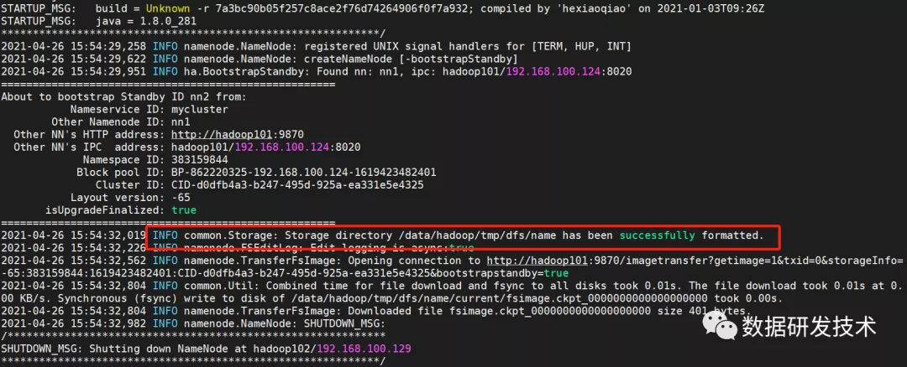

1. 格式化zookeeper节点，出现以下信息即为执行成功（在hadoop101执行）

   伪分布式不用执行本步骤

   ```
   hdfs zkfc -formatZKssh 
   ```

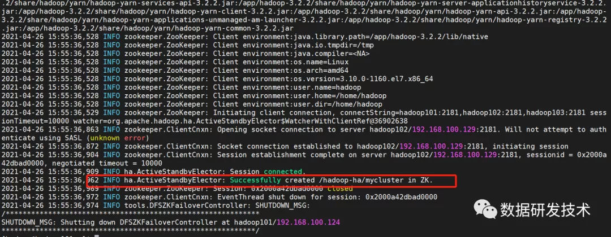

1. 启动hdfs集群（在hadoop101执行）

   ```
   start-dfs.sh
   # 随后查看各机器进程
   jpsall
   ```

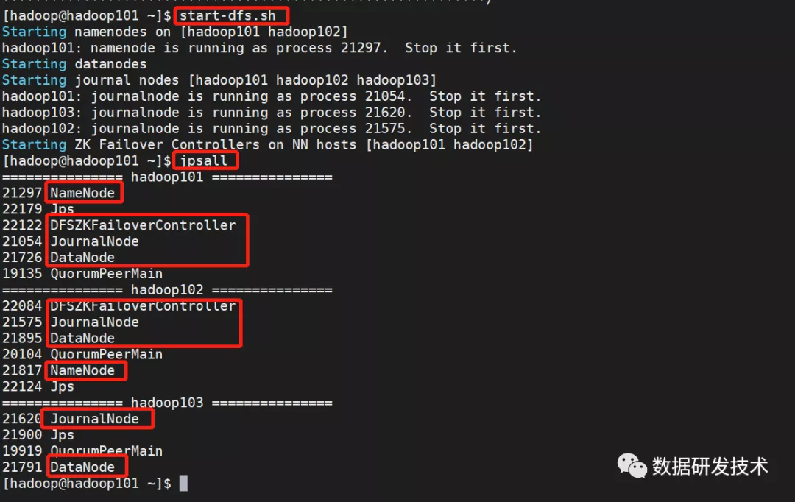

### 4. 日常启停HDFS集群

1. 启动hdfs

   ```
   start-dfs.sh
   
   # 若报错:publickey,gssapi-keyex,gssapi-with-mic,password
   # 是因为ssh配置问题,需要生成~/.ssh/authorized_keys文件
   ```

2. 关闭hdfs

   ```
   stop-dfs.sh
   ```

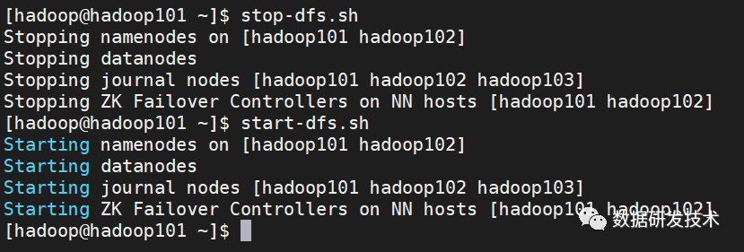

### 5. 页面查看集群

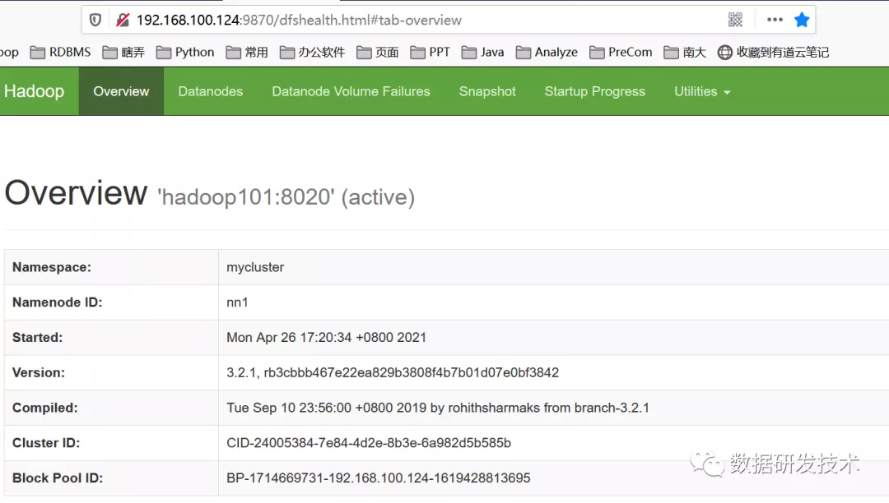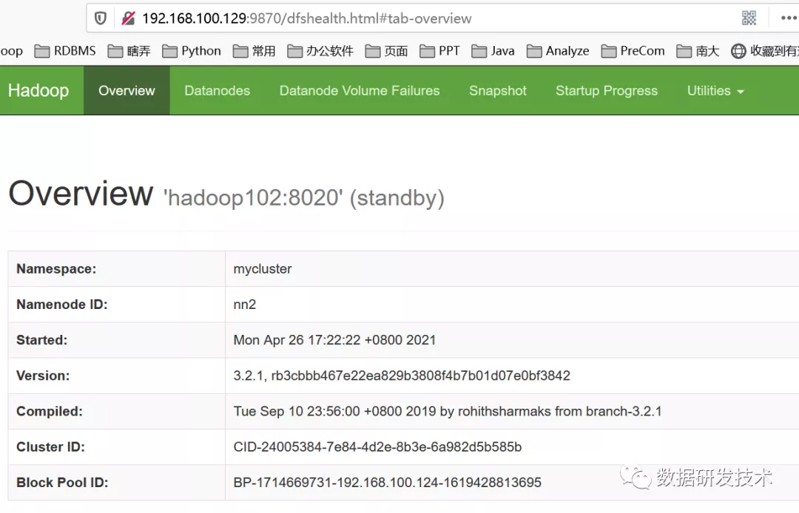

### 6. 配置YARN及其HA

使用yarn来管理hdfs集群的资源分配。

#### 6.1. 文件配置 

##### 6.1.1 配置hadoop-env.sh

因为hadoop3限制必须要声明角色运行进程，所以在配置文件中加以说明。

- 

```
vi /app/hadoop-3.2.2/etc/hadoop/hadoop-env.sh
export YARN_NODEMANAGER_USER="hadoop"
export YARN_RESOURCEMANAGER_USER="hadoop"
```

##### 6.1.2 配置mapred-site.xml

- 

```
vi /app/hadoop-3.2.2/etc/hadoop/mapred-site.xml
<property>
    <name>mapreduce.framework.name</name>
    <value>yarn</value>
</property>

<property>
    <name>mapreduce.application.classpath</name>
    <value>$HADOOP_MAPRED_HOME/share/hadoop/mapreduce/*:$HADOOP_MAPRED_HOME/share/hadoop/mapreduce/lib/*</value>
</property>

<!-- 历史服务器端地址 -->
<property>
    <name>mapreduce.jobhistory.address</name>
    <value>hadoop102:10020</value>
</property>

<!-- 历史服务器web端地址 -->
<property>
    <name>mapreduce.jobhistory.webapp.address</name>
    <value>hadoop102:19888</value>
</property>

<!-- mapred-site.xml中设置Map和Reduce任务的内存配置如下：(value中实际配置的内存需要根据自己机器内存大小及应用情况进行修改) -->
<property>
    <name>mapreduce.map.memory.mb</name>
    <value>1024</value>
</property>
<property>
    <name>mapreduce.map.java.opts</name>
    <value>-Xmx1024M</value>
</property>
<property>
    <name>mapreduce.reduce.memory.mb</name>
    <value>1024</value>
</property>
<property>
    <name>mapreduce.reduce.java.opts</name>
    <value>-Xmx1024M</value>
</property>
```

##### 6.1.3 配置yarn-site.xml

```
<!-- 指定MR走shuffle -->
<property>
 <name>yarn.nodemanager.aux-services</name>
 <value>mapreduce_shuffle</value>
</property>
<!-- 固定写法 -->
<property>
 <name>yarn.nodemanager.env-whitelist</name>
 <value>JAVA_HOME,HADOOP_COMMON_HOME,HADOOP_HDFS_HOME,HADOOP_CONF_DIR,CLASSPATH_PREPEND_DISTCACHE,HADOOP_YARN_HOME,HADOOP_MAPRED_HOME</value>
</property>

<!-- yarn的集群id -->
<property>
 <name>yarn.resourcemanager.cluster-id</name>
 <value>yarncluster</value>
</property>

<!-- 启用HA -->
<!-- 伪分布式时,请设置为false,会出现  -->
<property>
 <name>yarn.resourcemanager.ha.enabled</name>
 <value>true</value>
</property>

<property>
 <name>yarn.resourcemanager.ha.rm-ids</name>
 <value>rm1,rm2</value>
</property>

<property>
 <name>yarn.resourcemanager.hostname.rm1</name>
 <value>hadoop101</value>
</property>

<property>
 <name>yarn.resourcemanager.hostname.rm2</name>
 <value>hadoop103</value>
</property>

<!-- webapp的地址务必要配置，不然yarn可以启动但是无法执行map任务，大坑 -->
<property>
 <name>yarn.resourcemanager.webapp.address.rm1</name>
 <value>hadoop101:8088</value>
</property>

<property>
 <name>yarn.resourcemanager.webapp.address.rm2</name>
 <value>hadoop103:8088</value>
</property>

<property>
 <name>hadoop.zk.address</name>
 <value>hadoop101:2181,hadoop102:2181,hadoop103:2181</value>
</property>

<!-- 启用自动恢复 -->
<property>
 <name>yarn.resourcemanager.recovery.enabled</name>
 <value>true</value>
</property>

<!-- 持久化方式，既然启用了ZK那就把信息存储到ZK里面 -->
<property>
 <name>yarn.resourcemanager.store.class</name>
 <value>org.apache.hadoop.yarn.server.resourcemanager.recovery.ZKRMStateStore</value>
</property>

<!-- 自动检测硬件配置，视机器配置酌情开启，默认关闭 -->
<property>
 <name>yarn.nodemanager.resource.detect-hardware-capabilities</name>
 <value>false</value>
</property>

<!-- 开启日志聚集功能 -->
<property>
 <name>yarn.log-aggregation-enable</name>
 <value>true</value>
</property>
<!-- 设置日志聚集服务器地址 -->
<property>  
 <name>yarn.log.server.url</name>
 <value>http://hadoop102:19888/jobhistory/logs</value>
</property>
<!-- 设置日志保留时间为7天 -->
<property>
 <name>yarn.log-aggregation.retain-seconds</name>
 <value>604800</value>
</property>

<!-- 配置yarn资源，要根据实际情况配置，避免各种问题-->
<!-- 每个节点可用内存,单位MB，一般为实际内存*0.8 -->
<property>
 <name>yarn.nodemanager.resource.memory-mb</name>
 <value>4096</value>
</property>
<property>
 <name>yarn.nodemanager.resource.cpu-vcores</name>
 <value>4</value>
</property>
<property>
 <name>yarn.nodemanager.vmem-check-enabled</name>
 <value>true</value>
 <description>Whether virtual memory limits will be enforced for containers</description>
</property>
<property>
 <name>yarn.nodemanager.vemem-pmem-ration</name>
 <value>2.1</value>
 <description>Ration between virtual memory to physical memory when setting memoery limits for containers</description>
</property>
<property>
 <name>yarn.nodemanager.pmem-check-enabled</name>
 <value>true</value>
</property>
<property>
 <name>yarn.scheduler.minimum-allocation-mb</name>
 <value>1024</value>
</property>
<property>
 <name>yarn.scheduler.maximum-allocation-mb</name>
 <value>4096</value>
</property>

<!-- 参考配置,暂不配置 -->
<!--
<property>
 <name>yarn.app.mapreduce.am.resource.mb</name>
 <value>2048</value>
</property>
<property>
 <name>yarn.app.mapreduce.am.resource.cpu-vcores</name>
 <value>1</value>
</property>
-->
```

#### 6.2. 启动yarn

```
# 先同步配置文件到各服务器
xsync /app/hadoop-3.2.2/etc/hadoop
# 启动yarn
start-yarn.sh
```

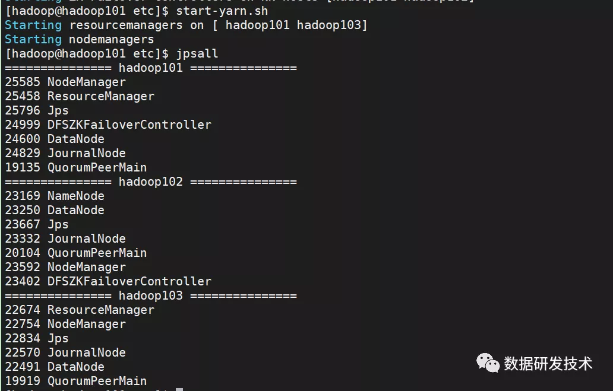

#### 6.3. web页面查看

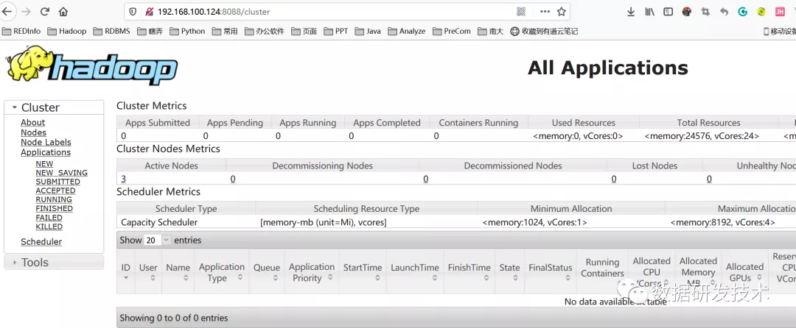

### 7. 历史服务器配置

为了查看程序的历史运行情况，需要配置一下历史服务器，步骤如下：

#### 7.1. 配置mapred-site.xml

- 

```
vi /app/hadoop-3.2.2/etc/hadoop/mapred-site.xml
```

添加下列配置

```
<!-- 历史服务器端地址 -->
<property>
    <name>mapreduce.jobhistory.address</name>
    <value>hadoop102:10020</value>
</property>

<!-- 历史服务器web端地址 -->
<property>
    <name>mapreduce.jobhistory.webapp.address</name>
    <value>hadoop102:19888</value>
</property>
```

#### 7.2. 启动历史服务器

```
mapred --daemon start historyserver
# 关闭
mapred --daemon stop historyserver
```

### 8. 日志聚集

日志聚集概念：应用运行完成以后，将程序运行日志信息上传到HDFS系统上。

#### 配置yarn-site.xml

- 

```
vi /app/hadoop-3.2.2/etc/hadoop/yarn-site.xml
<!-- 开启日志聚集功能 -->
<property>
    <name>yarn.log-aggregation-enable</name>
    <value>true</value>
</property>
<!-- 设置日志聚集服务器地址 -->
<property>
    <name>yarn.log.server.url</name>
    <value>http://hadoop102:19888/jobhistory/logs</value>
</property>
<!-- 设置日志保留时间为7天 -->
<property>
    <name>yarn.log-aggregation.retain-seconds</name>
    <value>604800</value>
</property>
```

同步配置到各服务器

```
# 先同步配置文件到各服务器
xsync /app/hadoop-3.2.2/etc/hadoop
```

### 9. 常用命令

```
# 查看集群可用空间等
hdfs dfsadmin -report

# 查看空间使用情况
hadoop fs -du -h /

# 查看namenode是否处于只读模式下
hdfs dfsadmin -safemode get
```

------

关注本公众号**数据研发技术**回复：**hadoop** 获取完整文档